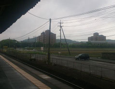
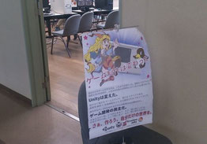
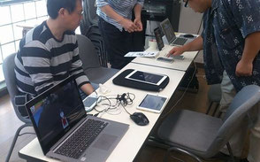

import OGP from "../../layouts/OGP.astro";

5月16日に岡山県立大学で[「Unity勉強会＠岡山広島合同展示」](/news/2015-04-22-unity勉強会-岡山広島-合同展示-やります-5月16日10時-岡山県立大学)を行いました。またこの企画は[オープンセミナー岡山2015](http://okayama.open-seminar.org/)のサブイベントです。

今回は広島Unity勉強会の人という事で参加させて頂きました。私はVitaのPSMで動作するゲームと私が所属しているゲームサークル[CrowSullCore](http://crowsullcore.jimdo.com/)が出している[Religion](http://crowsullcore.jimdo.com/)を展示しました。

その他、岡山Unity勉強会主催者のねやのさんのゲームや、他の参加者のゲームを展示しました。どれも独創的で完成度が高かったです。

よそ者にも関わらず快く迎えてくださった皆さん、ありがとうございました。

また今後も岡山Unity勉強会と交友を続けていく所存です。その第二弾として、8月頃に岡山Unity勉強会と合同で、ゲームジャムを行う予定です。詳細は後ほどお伝えします。

岡山県立大学です。すごくノドカです…

入口にはポスターを設置しました。

ゲームの展示風景。繁盛していました。
