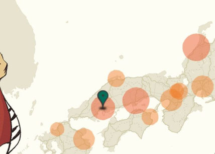

いつも広島Unity勉強会のサイトをご覧いただき、ありがとうございます。
さて、Unity公式ページにある、[Unity県人会議](https://kenjin.unity3d.jp/)の地図ですが、中国地方のUnityコミュニティがものすごく盛り上がってます。
そこで、ここから数か月先までの中国地方のUnity関連イベントについてお知らせします。

### [東北ITコンセプト 福島GameJam 2015 in 岡山 8月22日(土)～23日(日)](https://okayamaunity.doorkeeper.jp/events/28570)
中四国発のゲームジャムが岡山で開催します。IGDA主催の[福島GameJam](http://fgj.igda.jp/?p=3080)の遠隔拠点として、2日という短い時間でゲームを一つ作っていきます。また一般の方も終了後、作成されたゲームをエントリーは8月22日まで受け付けてるので、興味ある方は今すぐ代休取得申請して行きましょう！
また広島Unity勉強会も協力させて運営協力させて頂いています。

### [HMCN キックオフ - センサー&デバイス祭り　9月12日(土)](https://hmcn.doorkeeper.jp/events/29799)
広島県で初のKinectとIoTイベントを開催です。またイベント内では VR界で著名な「石原茂和さん(広島国際大学)」が参加され、今時代のVRや発展について発表されます。
そのほか、モーションセンサーについて勉強したい！という方にはお勧めの勉強会です。

### [第82回「WTM ＋ 広島Unity勉強会」 9月13日(日)](http://www.webtouchmeeting.com/)
遂に広島にユニティ・テクノロジーズ・ジャパン合同会社の常名さんがいらっしゃいます！
初心者向けハンズオン(1からゲームを作ってみる)とアセットもくもく会を同時開催の予定です。
しかもなんと、広島のWeb系勉強会 [WebTouchMeeting](http://www.webtouchmeeting.com/) と合同で行います。滅多にない機会ですので、お楽しみにお待ちください。

### [オープンソースセミナー2015 Hiroshima 広島Unity勉強会展示ブース・セミナー 9月19日(土)](http://www.ospn.jp/osc2015-hiroshima/)
広島Unity勉強会の人が作ったゲームやゲームジャム、そのほか様々な展示をします。
またセミナーでは「[ユニティちゃんだけじゃない! オープンソースとUnityの未来](https://www.ospn.jp/osc2015-hiroshima/modules/eguide/event.php?eid=16)」というテーマで発表します。
無料で参加できますので、是非お越しください！

---

まだまだあります、以下は予定されているイベントです！

* [Unity勉強会＋Unityもくもく勉強会、同時開催！](https://okayamaunity.doorkeeper.jp/events/31414) (岡山 / 9月26日)
* [これがVRの実力か！オキュラス・GearVR勉強会＆体験会](https://okayamaunity.doorkeeper.jp/events/31370) (岡山 / 10月3日)
* 高梁ゲームジャム (岡山 / 10月ころ)
* Oculus Game Jam Hiroshima (仮 / 広島)
* グローバルゲームジャム 岡山会場 2016年1月29日～31日(仮)

この他にも今後も定期的にゲームジャムやイベントを開催予定です。
また広島Unity勉強会では今後も中四国のゲーム開発を盛り上げていきます。お楽しみに。
