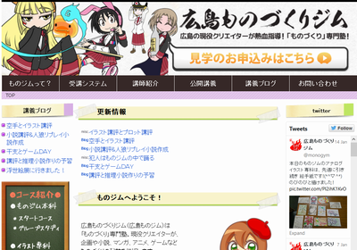
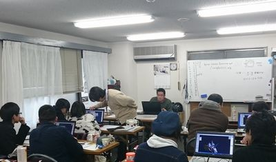

**追記：講座終わりました。** また内容は[こちらでまとめてます](/news/2016-03-27-コラム-広島ものづくりジムでUnityを教えました)。

これまで広島Unity勉強会では、Unityに関するイベントを開いてきました。

そして今回新たに、広島のクリエイター向け塾 [広島ものづくりジム](http://monogym.net/) さんで **ゲーム制作体験プログラム** で広島Unity勉強会のメンバが講師をすることになりました。

内容はMetasequoiaを使った「モデリング講座」とUnityを使った「ゲーム制作講座」を行います。ゲーム制作を通して、創る楽しさを知ってもらえるような講座にしていきます。

**講師**

 * 佐々木順昭 ([lemonte.net](http://www.lemonte.net/) / モデリング講座担当)
 * 中奥貴浩 ([CrowSullCore](http://crowsullcore.jimdo.com/) / ゲーム制作講座担当)

*授業風景*

講座は1月16日(土)から行い、3月頃まで毎週土曜日で講座を行います。

講座を受けるためには、ものづくりジムの「ものづくり本科」を受講して頂く必要があります。詳しくは[ものづくりジムのページ](http://monogym.net/)をご覧ください。

追記 : [ものジムブログ](http://monogym.net/archives/2625)で取り上げられました！
