こんにちは。広島Unity勉強会のナカオク([@csc_kamera25](https://twitter.com/csc_kamera25))です。

今回は広島ものづくりジムさんで、1月から3か月間でUnityゲーム制作講座を開きましたので、その振り返りをしていきます。

どうぞお時間があるときに、お読みくださいね。

## 広島ものづくりジムとは

[広島ものづくりジム](http://monogym.net/)(以下、ものジム)は、**広島のクリエイター養成塾でマンガやイラスト、ストーリなどの作り方を学ぶ塾**です。

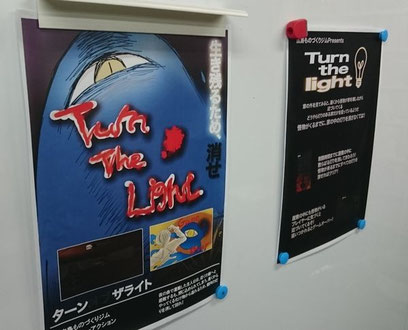

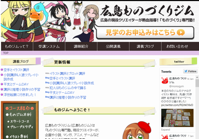

主催しているのは、[織田健司さん](http://monogym.net/teachers)(以下、織田先生)。広島のゲーム会社コンパイルでぷよぷよや魔導物語を手掛けてました（注1）。

今の織田先生はこのものジム講師の他、専門学校の先生、就労支援団体の先生、ライトノベル作家を兼務されています。

織田先生はゲーム脚本家とノベル作家の経験をもとに、ストーリ作成を中心に、**どうやってサブカルで食っていくか**をジム生さんに教えられています。

(注1) 若い人は知らんと思いますが、ぷよぷよ も アルル も元々セガのものじゃないんですよ。

## ものジムとの出会い

私が初めて、ものジムの事を知ったのは2015年3月に開催された [広島の楽しい100人](http://hiroshima.100person.jp/) がキッカケです。このイベントで[織田先生が出演され、ものジムについて](http://hiroshima.100person.jp/speakers/monogym-oda/)話しました。

発表後、Webサイトを見て、面白い組織だなぁと感じましたが、広島Unity勉強会から何かをしましょうと話しかける事もありませんでした。

いつか何か出来れば楽しそうだなぁ、そう考えながら月日は経ちました。

## ゲームジャムとの出会い

その後、[岡山Unity勉強会](http://okauni.jimdo.com/)と[中四国ゲームジャム実行委員会](http://gamejam-westjp.wix.com/main)に協力し、中四国地方で初めてのゲームジャム、[福島ゲームジャム2015 岡山会場](http://fgj.igda.jp/)を立ち上げました。

そんなこんなでゲームジャムに参加したり、運営に関わったりしてました。あと本職も忙しかったりして、時間が取れず。6月から11月まで何かゲームイベント関連作業してました。

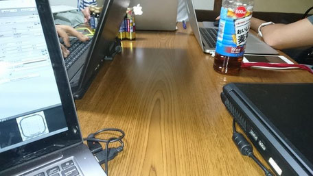

## ものジムに行ってみた

11月の後半、色々落ち着いてきました。広島のIT勉強会にもまたちょくちょく顔をだすくらいになりました。

11月の [WebTouchMeeting](http://www.webtouchmeeting.com/) で佐々木さん(注2)がフリーランスに戻られたと報告を受け、またその事を織田先生に伝えに行くという話でした。

WTMが終わり、時刻は9時。自分も暇だったのでついていくことにしました。こんな時間なのに押しかけて大丈夫かなぁ、と思いつつものジムへ。

ものジムへ行ってみると、ジム生さんと織田先生が話し合いをしていました。初対面のご挨拶、広島Unity勉強会について、自分が何をしているのか説明しました。

ゲームジャムの話に移った時、織田先生が噛みつきました。そこで今のゲームジャムについて生まれた背景や地方での取り組みを紹介していきました。

その後、時刻は10時半、先生から言われました。

**「それって、うちで出来ませんか？」**

出来る。とは即答できませんでした。当時はジム生のスキルも分かりませんし、広島Unity勉強会にもそういった教育のノハウが全くなかったですし。

佐々木先生も「できるのかねぇ」と。専門学校で2年でやるようなカリキュラムを短期間でやる事は、チャレンジでした。

(注2) 佐々木順昭さん。専門学校の先生、また広島のゲーム開発者で広島Unity勉強会のメンバ。

## 準備

まず、織田先生からものジム生がゲームジャムについて説明して欲しい。という事で土曜日昼にジムを訪れました。

ゲームジャムの内容を説明し、実際にやってみませんかと話したところ、やりたいという声が多数派でした。またジム生の中には、実際にゲームジャムを見てみたいと要望がありました。

そこで [Hiroshima Student Community](https://hsc15.doorkeeper.jp/) にお願いして、[VR Game Jam in 広島会場](https://hsc15.doorkeeper.jp/events/31698) をジム生に見学させてもらいました。話で聞くより実際に見た方が、ゲームジャムにがどんなものなのか理解が深まったようでした。

また同時並行で佐々木先生と、[すごい広島](http://great-h.github.io/)でカリキュラムの作成も行いました。[カリキュラムはこちら](https://docs.google.com/document/d/1MdCuKY0VROonhOb2l-L5wCO9enlAO0IRsQwCEuOTbnk/edit?usp=sharing)で見ることが出来ます。

これには岡山Unity勉強会とも相談しました。また[岡山理科大の山根先生](http://www.mis.ous.ac.jp/research/dm_yamane.html)には学術的にゲームジャムの効果についても教えてもらい、非常に参考になりました。

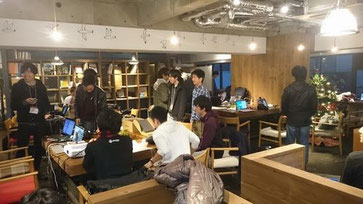

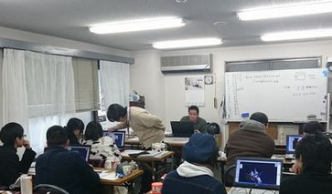

## メタセコイア講座開始(1月)

毎週土曜日、13時半から18時まで、1月から3月までゲーム制作プログラムが始まりました。

まずはUnity…といきたいですが、まずは3D空間に慣れていかなければなりません。そこで1月は佐々木先生が[メタセコイア](http://www.metaseq.net/jp/)の講座を行いました。

**メタセコイア**は、3Dモデリングソフトです。簡単に3D空間の物を作るソフトウェアです。

ジム生は慣れない空間にも関わらず、アニメのキャラや、飛行機を作っていきました。どうやれば作りたいものを作れるのか試行錯誤していました。

こうしていつも遊んでいるゲームや、見ている3D映画がどのようなもので構成されているのか、学んでいきました。

## Unityゲーム制作講座(2月・3月)

2月からはナカオクがUnityについて講座を担当しました。

初日はUnityについて、活用方法、実際に玉ころがしゲームを作っていきました。

ジム生の多くはプログラミングをしたことがない、もしくは専門学校で少し学んだといったレベルでした。

なので最初はプログラミングさせないで、ゲームを作成して、苦手意識をなくす事を心がけました。「これならできそう！」と思えることが大切なので。

2日目以降は、実際にゲームジャム形式でやってみる事にしました。また実際のゲームジャムのようにテーマを設定しました。

「[Extinction](http://extinction/)」

これは[グローバルゲームジャム2011](http://globalgamejam.org/)のテーマです。

私自身、ものジム生がこの同じテーマで何を作るのか興味がありました。

続いてはゲームのアイデア出しです。これにはユニティの常名さんが考案した、マジカルバナナ方式を使いました(注3)。

そして書いてもらったマジカルバナナから、アイデアを考えてもらい企画書を作ってもらい投票で決めました。6個の中から2つを決め、それぞれ作りたい企画に分かれてもらいました。

[注3.詳しくはここのP.24以降参照](http://www.slideshare.net/takashijona/game-jam-51128855)

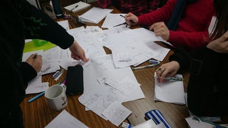

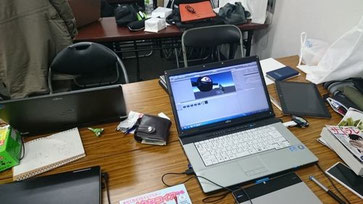

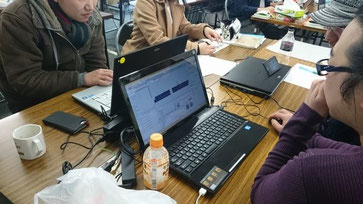

まず企画をペーパプロトタイピングしてもらいました。これで実際にゲームに何が必要か、どうすれば楽しくなるか考えます。

またプロトタイピングをすることで、製作者同士の齟齬をなくしたり、企画の中核(=一番大切なところはどこか)を決めることが出来ます。

紙にキャラやハート、ステージを書き、どのように動けばよいか、どうすればゴールなのかを手を動かして考えます。

あとブレーンストーミング形式で「批判するなら代案だせっ！」をモットーに行いました。

その後6週かけてUnityでゲームを作っていきました。チームでデザイナーとプログラマに分け、素材などを作っていきます。

最初のうちはUnity の 初歩的な質問が多かったですが、そのうちジム生さん同士で相談するようなり、解決するようになりました。

また各チームは毎回終了1時間前にはプレゼンを行い、今日はどこまで進んだか、次は何をしなくてはいけないか発表していきました。

日が進むごとに完成度が上がっているのが、着実に成果として見えてきました。

## ものジムゲームジャム終了！ 最終発表会

3月19日17時、2か月間の開発が遂に終わりました。発表会は、

**パワーポイントでなく、好きな方法で自分のゲームを魅力的に見せる方法を使ってください。**

お願いしてみたところ、1つのチームは紙芝居、もう1つのチームはパッケージ風な画像を作っていました。ではできたゲーム紹介をしていきます。

**●もぐもぐゾンビスクランブル チーム**

主人公はコウモリ。マウスで操作して、ゾンビの頭に様々なパーツを載せていきます。説明するより紙芝居作者のスライド見た方が分かりやすいです([パート1](https://twitter.com/tokoritomotori/status/711105507503661056)/[パート2](https://twitter.com/tokoritomotori/status/711105579775733760))。

デザインがすごく凝っていて、全てものジム生のオリジナル。

**●Turn The Light チーム**

Turn The Lightチームは、館の中をめぐり電気がついているランプを時間内に全て消すというゲームを作りました。

FPS視点で操作し、消していくのですが途中お化けなどもおり、一筋縄ではクリアできませんでした。

実際のゲームはものジムサイトで後程公開されるそうです。是非やってみてくださいね。

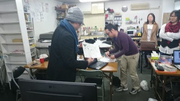

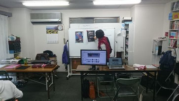

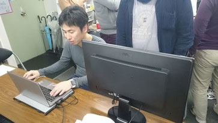

## もっとUnityを使いたくなる勉強会 in 広島ものジム

3月26日の最終回では、東京のユニティテクノロジーズジャパン合同会社から[常名隆司先生](https://twitter.com/takashijona)をお呼びして講演して頂きました。

リクエストは**「アセットを使ったマネタイズ」**や**「アセットストアに出してみましょう」**という内容でした。

その内容に加えて、ものジム生に向けて**「どうやって自分のゲームをやってもらうか」**という内容も発表して頂きました。

少し辛口な内容でしたが、ゲーム関わらず作品全般(イラストや漫画)にも共通の内容でジム生からも高い評価でした。

その他、外部から来られた大学生さんがLTをしたり、常名さんに向けてジム生が作ったゲームの発表会&体験会を行いました。

また勉強会終了後、懇親会も行って和気あいあい楽しみました。

## 最後に

このイベントが出来たのは、ものジム生の方、広島や岡山のITコミュニティ、Unity関係者おかげです。

本当に協力ありがとうございました。

個人的に1番ほっとしているのは、脱落者が出ずゲームとして形になったことです。

またプログラミング未経験者にゲーム制作を教えるという貴重な経験ができました。

広島Unity勉強会では、今後も広島のゲーム制作を盛り上げていきます。よろしくお願いしますね。
