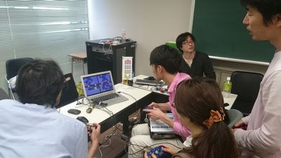
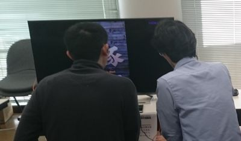
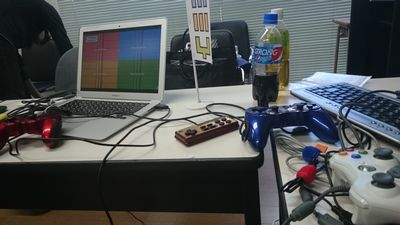
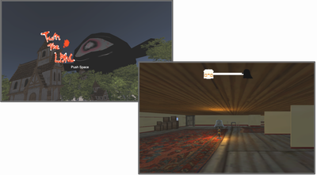
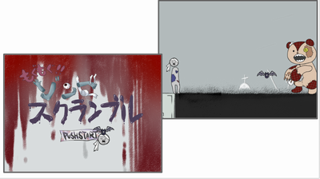
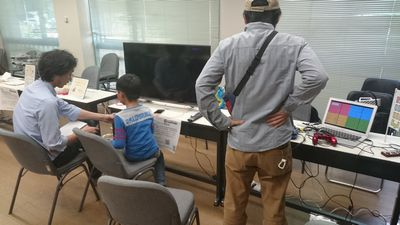

import OGP from "../../layouts/OGP.astro";

5月14日(土)に[オープンセミナー2016@岡山](http://okayama.open-seminar.org/)が開催されました。

今年も岡山Unity勉強会と合同で展示ブースを開かさせて頂きましたので、その模様をお届けします。(去年の風景は[こちらから](/news/2015-05-17-unity勉強会-岡山広島-合同展示-を開催しました))

場所は[岡山県立大学](http://www.oka-pu.ac.jp/index.php)です。周りにあるのはマンションと田んぼくらいしかない、自然豊かなのどかな場所で行われました。

展示されたゲームは全部、岡山Unity勉強会、広島Unity勉強会、広島ものづくりジムの方が制作されたものです。

## 岡山Unity勉強会

・[ヨミミコ](http://okauni.jimdo.com/games/yomimiko/)

[かふうさん](https://twitter.com/neyano_jp)や[VeLTiNaさん](https://twitter.com/maoh_vel)たちが、[グローバルゲームジャム in 岡山](http://globalgamejam.org/2016/jam-sites/okayama)で作成されたゲームです。4人対戦型の対戦アクションゲームで、最階層にあるハートを地上まで持ってくることが目的になります。

お子さんから、大人まで様々な方から人気がありました。

### [豚](http://okauni.jimdo.com/games/pig/)

[ちゃかぽさん](https://twitter.com/chakapo)が作成した、アクションゲーム。[QWOP](https://www.youtube.com/watch?v=vTq-fIrxHAE)に似た操作が難しい豚を前進させ、後ろから追いかけてくる敵から逃げるのが目的です。

### [WISH DRAGON](http://okauni.jimdo.com/games/wish-dragon/)

[VeLTiNa](https://twitter.com/maoh_vel)さんが制作した、レトロ風RPGゲーム。細かく表現されたドット絵が独自の世界観を出していました。またSteamで全世界配信も控えているそうなので、超楽しみです。

### [筋肉兄貴シリーズ](http://meistersoft-showgames.webnode.jp/)

[ShowGames](https://twitter.com/ShowGames_shoji)さんの代表作、[筋肉兄貴シリーズ](http://www.ksg-m.com/all/hyoka/ksgh054/)です。短時間でサクッと出来るミニゲームシリーズです。
スクリーンに映し出された兄貴の姿に酔いしれた！

## 広島Unity勉強会

今回は[広島ものづくりジム](http://monogym.net/)さんで作成されたゲームを展示しました。ものジムさんとは、[1月から3月までUnity講座](/news/2016-03-27-コラム-広島ものづくりジムでUnityを教えました)を開かさせて頂きました。

### Turn The Light

*館に超巨大お化けが迫ってきてる！気づかれないように早くランプの明かりを消さなければ…*

FPS視点のホラーゲームです。館の中にはお化けが徘徊しており、それから逃げつつランプを全て消すのが目的になります。

プレイヤーの感想としては、「少し難しい」、「雰囲気が良い」という意見や「お化けが可愛い」という小学生の意見もありました。

### もぐもぐゾンビスクランブル

*もいで、もいで、もぎまくれ！ゾンビにパーツをくっけて、敵をやっつけろ！*

マウスを使ったアクションゲームです。「もぐ」というのは広島弁で「剥ぎ取る」という意味で、敵から手をもぎっとしたりします。

また道中のブロックを落としたりして、ゾンビの行く手を支援してあげるのもプレイヤーである「こうもり」の役割です。

感想としては「デザインが凝ってる」、「独特な世界観が良い」、「チュートリアルが欲しい」という意見がありました。

イベントに参加してみて思ったのが、**楽しく遊んでくれる人の顔を見るのはやっぱり嬉しい**。という事です。

今年は特に子連れの方が多い印象でした。また **「Scratchを使ってRPGが作りたいんだ！」** という9歳の小学生も来られて、VeLTiNaさんが教えてました(結構厳しめの助言してました)。

今後もゲームを作りたい人達を応援し、繋げるコミュニティとして頑張っていきますので、よろしくお願いしますね。

### 関連項目

 * [オープンセミナー2016@岡山](http://okayama.open-seminar.org/)
 * [展示ブースについて - OSO2016](http://okayama.open-seminar.org/exhibition.html)
