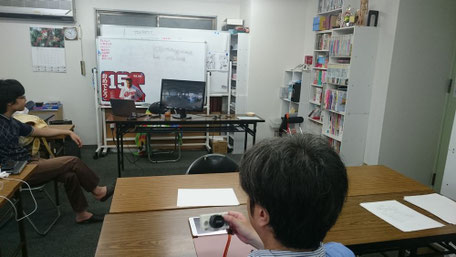
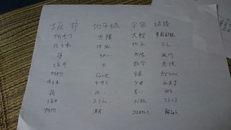
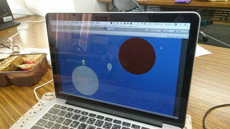
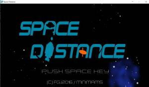
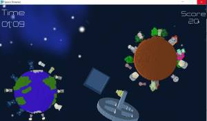

import OGP from "../../layouts/OGP.astro";

こんにちは。広島Unity勉強会のナカオク([@csc_kamera25](https://twitter.com/csc_kamera25))です。

少し遅くなりましたが、7月30日と31日の二日間にわたって、**福島ゲームジャム2016 in 広島**を開催しました。その模様をお届けします。

ところでゲームジャムを知らない人も結構いるのではないでしょうか。
 
ゲームジャムは 短時間(今回は30時間)で会場に集まった人たちとゲームを一本作るイベントです。詳しくは[Wikipedia](https://ja.wikipedia.org/wiki/ゲームジャム)をご覧くださいね。

## 1. 参加人数4人!最小のFGJ会場での出来事。

広島会場は宣伝不足や広報が遅れてしまった影響で、参加人数が運営含め4人と **世界で最も小さな福島ゲームジャム会場(Smallest Fukushima Game Jam satellite in world)** になってしまいました。(当日ドタキャンがあったりもしました)。
 
ですがそれを跳ね返すぐらい **楽しいゲーム** を作ってやろうとチーム一丸となって開発に取り組んでいきました。

## 2. 10時～14時 アイデアソンとプレゼン制作

今回のテーマは「Distance」。

今回のテーマは「Distance」。英語で距離や長さを表しますが、それにとらわれないアイデアが必要となります。
 
まずはプログラミング！といきたいところですが、先立つもの(=アイデア)がなければ先に進めません。というわけでアイデアソンを行いました。
 
ユニティ日本法人の常名さんのスライド、[ゲームジャムを楽しもう(リンク切れ)](http://www.slideshare.net/takashijona/game-jam-51128855)のP.27にある「マジカルバナナ」方式でアイデアを出していきました。
 
すると「距離→長い→羅生門」「距離→目的地→旗取ゲーム」といった言葉が出てきました。その中に「距離→遠い→宇宙」といった言葉が出てきました。
 
そこから 惑星間を移動するスペースシップ というアイデアを思いつきました。
 
また福島ゲームジャムにはレギュレーションがあり、その一つに 福島の子どもたちが書いた絵を使う とルールがあります。
 
では惑星に子どもたちの絵の生き物がいる惑星にしてしまえばよいのでは、というアイデアから急速にアイデアが固まってきました。
 
・・・
 
時間は14時。プレゼンではアイデアを考える時に使った、ペーパプロトタイピングを写真に載せ発表しました。

## 3. 14時～22時 アルファ版に向けて

プレゼンが終わったら、すぐ開発に取り組みました。なんせ時間がありません、初日の22時にはα版(ゲームが遊べる初期段階のバージョン)を仕上げる必要があります。
 
メインディレクターのサカイさんがプログラミングをしながら、デザイナーの佐々木さん、サウンドディレクターの榎さんにテキパキ命令をだしていきました。
 
途中バグが出て停滞するも、全員でデバッグを進めて何とか22時頃には最低限遊べる段階までいきました。
 
そしてサカイさんが全世界に向けて中継を行いました。酒井さんの緊張が伝わり、また自身に満ちた発表はとても印象的でした。
 
ここでサカイさんは翌日に急きょ別の要件が入ったため帰宅。私、ナカオクがプログラミングを書くことになりました。
 
チリの生放送を全員で眺めながら開発は進み、時間は23時。疲労困憊の中開発は危険な領域に突入します…

## 4. 23時～13時 ベータ版、そしてプレイアブルへ

数名が帰宅する中、深夜に渡ってゲームジャムは続きました。ベータ版は翌朝7時。寝る間はほとんどありません。
 
各々が最低限の素材を作る中、プログラミング担当の自分は胃をキリキリさせながら書いていきました。間に合うのか？魅力的になるのか？面白くなるのか？という不安がよぎります。
 
朝の6時。遂にキャラクターを宇宙船まで持っていく処理が出来ました。最低限ゲームぽい事が実装できました。
 
ベータ版の発表の後、プレイアブル版の製作が13時までに完成させるべく、ドンドンシステムやアイテムを追加していきました。

## 5. 13時～16時 完成、そして発表
あの素材が足りない！ここの部分が面白くない！この機能は時間がないから実装止めよう！という声が幾度か聞こえてきました。
 
16時には開発を終え、サーバにアップロードしなければなりません。面白いゲームにしよう、その一心で全員で開発に取り組みました。
 
そしてついに長いようで短い開発が終了しました。出来たのは…
 
星と星を飛び、惑星の住民を助ける宇宙アクションゲーム
スペースディスタンス
<OGP url="http://fgj.igda.jp/dokuwiki/doku.php?id=team:hirosima_2016_1" />

## 6. FGJを終えて。
福島ゲームジャム2016ですが、私個人としては 楽しかった！ です。満足いくゲームが作成できました。
 
また運営とプログラマという二足のワラジを履きつつ、作業するのは大変でしたがやりがいもありました。
 
ただ運営責任者としての課題は、やはり参加人数が少なすぎました。もっと専門学校の生徒さんや大学生さんを巻き込める環境を作っていくことや、広報の必要があると思いました。
 
またそれに加えて、広島Unity勉強会の活動をもっと盛り上げていきたいです。今後はゲームジャムだけでなく、VR、マネタイズなどのイベントを行い、広島のゲーム制作界隈を盛り上げていきたいです。
 
今後ともよろしくお願いしますね。