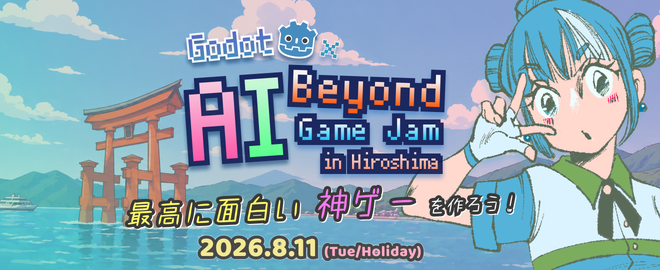
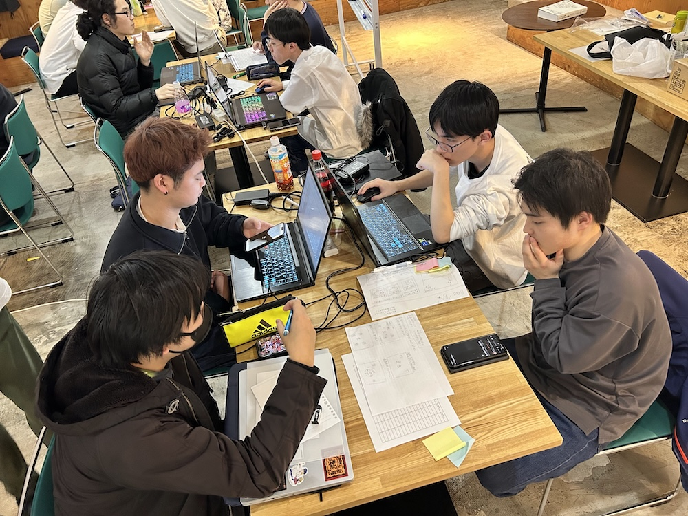

import OGP from "../../layouts/OGP.astro";

## 【今夏開催】Godot Engine×AIで挑む！「1日」限定の限界突破ゲームジャム、エントリー受付開始！

この夏、最高にエキサイティングな挑戦状（イベント）をお届けします！  
**広島Unity勉強会 x 広島ゲームエンジンユーザーグループ** が、この広島の夏を暑くします！

### Godot EngineとAIで「1日」でゲームを作成！？
今、軽量さと扱いやすさで開発者から熱い視線を集めているゲームエンジン「Godot Engine」。  
そして、コーディングや素材生成のスピードを爆発的に高めてくれる「AIツール」。

> 「この2つを掛け合わせたら、一体どれだけのスピードでゲームが作れるのだろう？」

そんなワクワクする実験と挑戦の場として、この夏「1Dayゲームジャム」を開催することが決定しました！  
限られた「1日」という時間の中で、みんなでアイデアを形にしてみませんか？

## このゲームジャムの見どころは？
### 1. 圧倒的なスピード感を体感できる！

「ゲーム開発は何ヶ月もかかるもの」という常識を覆します。  
1日、実質6時間というタイムリミットがあるからこそ、余計なものを削ぎ落とした「本当に面白いコアアイデア」が見えてくるはずです。

### 2. 「Godot Engine × AI」という最先端の掛け算

話題のGodot Engineを用いて、そこにエージェントコーディングなど、AIを活用したゲーム開発を体験します。  
これまでにない「最速の開発プロセス」を実践・模索する絶好のチャンスです。

### 3. モチベーションを高め合う仲間の存在

1人で黙々と作るのとは違い、同じ日に同じ目標に向かって駆け抜ける仲間がいます。  
お互いの進捗や完成品を見ることで、インスピレーションや大きな刺激を得られます。

## こんな方におすすめのイベントです！
 * Godot Engineを触ってみたい、勉強中の方
 * AIを活用した効率的なゲーム開発に興味がある方
 * 短期間で「1つの作品を作り切る」達成感を味わいたい方
 * 「初心者だけど、勢いでゲーム開発デビューしてみたい！」という方

「1日でゲームなんて作れるのかな…」と不安な方も心配いりません。  
一緒にGodot Engineに触れて、AIを使って爆速でゲームを作りましょう！

## 📅 イベント詳細＆エントリーはこちら！
詳細なタイムスケジュールや参加ルールは、以下のConnpassページをご確認ください。  
皆さんのご参加を、心よりお待ちしております！

<OGP url="https://hirouni.connpass.com/event/388323/" />

皆様とお会いできるのを楽しみにしています！
